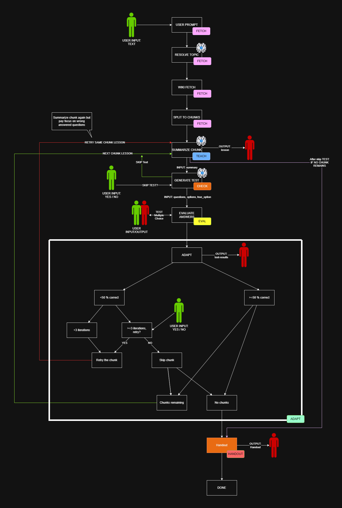

# State Machine

Die Lernlogik basiert auf folgender State Machine:

```text
FETCH -> TEACH -> CHECK -> EVAL -> ADAPT -> HANDOUT -> FINISHED
```

Das Diagramm liegt hier:

```text
docs/assets/ai-tutor-diagramm.png
```



## FETCH

Ziel: Thema entgegennehmen und Wikipedia-Artikel laden.

Ablauf:

1. Frontend fragt nach einem Thema.
2. User gibt ein Thema ein.
3. Backend löst den Begriff ggf. mit dem LLM auf.
4. Wikipedia-Fetcher lädt den passenden Artikel.
5. Artikel wird in Hauptabschnitte zerlegt.
6. Abschnittstitel werden an das Frontend gegeben.
7. State wechselt zu `TEACH`.

Frontend-Eingabe:

```text
input_kind = "topic"
```

## TEACH

Ziel: aktuellen Artikelabschnitt verständlich erklären.

Ablauf:

1. Backend nimmt den aktuellen Abschnitt.
2. Lesson-Prompt fasst den Abschnitt in einfachen Worten zusammen.
3. Zusammenfassung wird im Chat angezeigt.
4. State wechselt zu `CHECK`.

Wenn der User zuvor Fragen falsch beantwortet hat, werden diese Fragen als Fokus an die erneute Zusammenfassung übergeben.

## CHECK

Ziel: Test starten oder Abschnitt überspringen.

Ablauf:

1. Backend fragt, ob ein Test gestartet werden soll.
2. User wählt `ja` oder `nein`.
3. Bei `nein`: nächster Abschnitt.
4. Bei `ja`: LLM erzeugt Multiple-Choice-Fragen.
5. State wechselt zu `EVAL`.

Frontend-Eingaben:

```text
input_kind = "start_test_decision"
input_kind = "quiz_answers"
```

## EVAL

Ziel: Antworten auswerten.

Ablauf:

1. Frontend sendet die gewählten Multiple-Choice-Optionen.
2. Backend prüft richtige/falsche Antworten.
3. Ergebnis wird gespeichert.
4. Chat zeigt kurze Zusammenfassung des Testergebnisses.
5. State wechselt zu `ADAPT`.

Das Frontend zeigt während des Tests direkt:

- grün für richtige Antwort
- rot für falsch gewählte Antwort
- grün für richtige Option bei Fehlern

## ADAPT

Ziel: entscheiden, wie es weitergeht.

Logik:

- Wenn mindestens die Hälfte richtig ist: nächster Abschnitt.
- Wenn zu viele Antworten falsch sind: Abschnitt erneut erklären.
- Nach mehreren Fehlversuchen: User kann `nochmal` oder `skip` wählen.

Frontend-Eingabe:

```text
input_kind = "adapt_decision"
```

## HANDOUT

Ziel: PDF-Handout erzeugen.

Ablauf:

1. Wenn alle Abschnitte durchlaufen wurden, wechselt die Session in `HANDOUT`.
2. Backend erzeugt ein Markdown-Handout.
3. PDF-Generator rendert daraus eine PDF-Datei.
4. Backend gibt einen Download-Link zurück.
5. State wechselt zu `FINISHED`.

Zusätzlich kann ein Handout schon vor dem Ende erzeugt werden. Das verändert den Lern-State nicht. Der finale Handout-Schritt gilt erst als abgeschlossen, wenn der normale Ablauf wirklich `HANDOUT` erreicht.

## FINISHED

Ziel: Session ist abgeschlossen.

Weitere normale Lernschritte sind nicht mehr nötig. Das bestehende PDF kann heruntergeladen werden.
